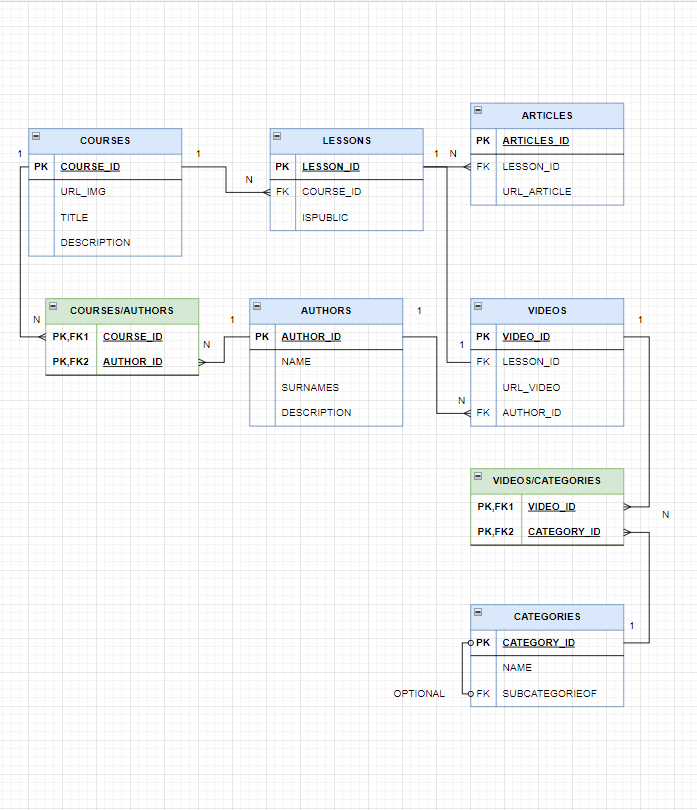

# Bootcamp Backend Módulo 1 Modelado 🍋

## Una startup tecnológica va a desarrollar un portal de E-Learning y nos ha pedido que realicemos el modelo de datos de dicho sistema.

- 1º Va a ser un portal orientado al mundo de la programación.
- 2º El portal va a estar compuesto por cursos; cada curso está compuesto, a su vez, por un número de videos y artículos que lo acompañen.
- 3º La página de cursos debe mostrar la lista de autores que los hicieron.
- 4º La página de un video debe mostrar el autor que lo realizó.
- 5º Los videos y el contenido de cada artículo se almacenan en un storage S3 y en un headless CMS; en la base de datos, solo almacenaremos los ID's a esos recursos.
- 6º Los videos se pueden clasificar por temáticas (DevOps / Front End / Back End / ...)
- 7º Los videos tienen autores (ponemos la restricción, un video tiene un autor), un curso puede tener varios autores.
- 8º En principio, los vídeos no se van a compartir entre diferentes cursos (aunque sería una aplicación interesante del ejercicio).
- 9º Hay una opción para ver la página con la biografía del autor.

## Parte opcional

Tener un solo nivel de áreas es limitado; lo suyo sería tener una estructura jerárquica, por ejemplo:
- Front End >> React
- Front End >> React >> Testing
- Front End >> Angular
- DevOps >> Dockers
- DevOps >> Serverless
- Backend >> Node.js
- Backend >> Node.js >> Express
- Backend >> MongoDB

Van a haber videos públicos y privados, es decir:
- Un curso puede ser 100% público.
- Un curso puede tener una parte inicial 100% pública, y otra solo para suscriptores.

# Diagrama propuesto

 

## Desarrollo

### Partiendo de la tabla COURSES:
- Tiene su campo ID como clave primaria.
- Tiene campos propios para almacenar una imagen de portada, un título y una descripción.
- Se relaciona con la tabla LESSONS de forma que un curso contiene varias lecciones, tal como indica el 2º punto, y cada lección pertenece a un curso (podría haber resultado interesante generar una tabla intermedia para el caso en el que una lección pueda ser transversal a varios cursos, como se sugiere en el 8º punto).
- Se relaciona con la tabla AUTHORS a través de una tabla intermedia de clave compuesta. Esto se debe a que, tal y como indica el punto 3º, un curso puede tener varios autores, y un autor varios cursos (podría haber resultado interesante que los autores se derivasen de los autores de los videos de las lecciones, pero este enfoque se basa en que el autor del curso no tiene por qué ser necesariamente el autor de los videos, sino que dispone de ellos).

### Partiendo de la tabla LESSONS:
- Tiene su campo ID como clave primaria.
- Tiene un campo COURSE_ID como clave foránea para su relación con la tabla COURSES (ya descrita).
- Tiene un campo propio ISPUBLIC de tipo booleano, para cumplir con el segundo apartado de la parte opcional. De esta forma, podemos gestionar qué lecciones del curso serán públicas.
- Se relaciona con la tabla VIDEOS de forma que una lección tendrá un video (podría cambiarse para que pueda tener varios).
- Se relaciona con la tabla ARTICLES de forma que una lección puede tener varios artículos (podría resultar más fácil suprimir la tabla LESSONS y pasar directamente a la tabla VIDEOS y que estos se relacionen con la tabla ARTICLES, pero este enfoque se basa en que alguna lección pueda disponer de varios artículos donde se expliquen cosas que no requieran estar ligados necesariamente al video).

### Partiendo de la tabla ARTICLES:
- Tiene su campo ID como clave primaria.
- Tiene un campo LESSON_ID como clave foránea para su relación con la tabla LESSONS (ya descrita).
- Tiene un campo donde se almacena la ID o URL para recurrir al lugar donde se almacena el recurso, de acuerdo con el 5º punto.

### Partiendo de la tabla VIDEOS:
- Tiene su campo ID como clave primaria.
- Tiene un campo LESSON_ID como clave foránea para su relación con la tabla LESSONS (ya descrita).
- Tiene un campo donde se almacena la ID o URL para recurrir al lugar donde se almacena el recurso, de acuerdo con el 5º punto.
- Tiene un campo AUTHOR_ID como clave foránea para su relación de acuerdo a las condiciones del 4º y 7º punto. Se trata de una relación en la que un video solo puede tener un autor, pero un autor puede tener varios videos.
- Se relaciona con la tabla CATEGORIES a través de una tabla intermedia de clave compuesta de acuerdo a las condiciones del 6º punto. Este enfoque se basa en que un video puede tener varias categorías y una categoría varios video (en referencia a las categorías >> subcategorías del primer apartado de la parte opcional).

### Partiendo de la tabla CATEGORIES:
- Tiene su campo ID como clave primaria.
- Se relaciona con la tabla VIDEOS a través de una tabla intermedia (ya descrita).
- Tiene su campo propio con el nombre.
- Se relaciona consigo misma a través de una clave foránea opcional. El campo SUBCATEGORYOF indica la CATEGORY_ID de su categoría predecesora, de forma que se pueda establecer una jerarquía, como se indica en el primer apartado de la parte opcional.

### Partiendo de la tabla AUTHORS:
- Se relaciona con la tabla COURSES a través de una tabla intermedia (ya descrita).
- Se relaciona con la tabla VIDEOS (ya descrita).
- Contiene la información propia del autor necesaria para cumplir con las necesidades del 9º punto. 

